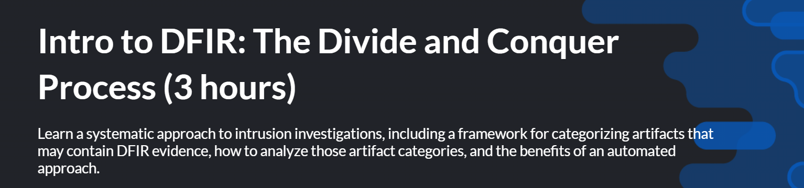
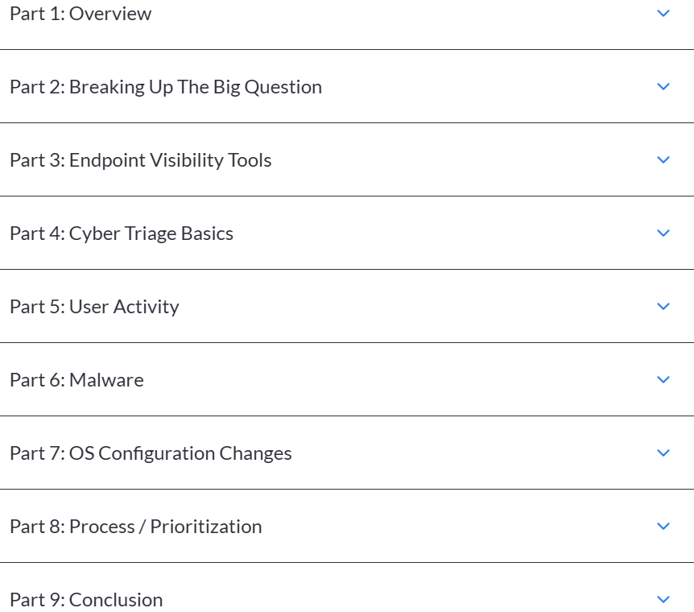

# 🔍 Intro to DFIR: The Divide and Conquer Process (SleuthKitLabs)

-darkblue?style=flat-square&logo=sleuthkit)

This repository contains **notes, labs, operations guides, and certificate of completion** for the *Intro to DFIR: Divide & Conquer* course by SleuthKitLabs.  
The course focuses on **digital forensics fundamentals, evidence handling, timeline analysis, and incident response** using SleuthKit and related tools.

---

## 📚 Notes

- 📄 [`01-introduction.md`](./notes/01-introduction.md) – Introduction to DFIR
- 📄 [`02-target-research-osint.md`](./notes/02-target-research-osint.md) – OSINT for target research
- 📄 [`03-pretexting-and-lure-design.md`](./notes/03-pretexting-and-lure-design.md) – Pretexting & lure design
- 📄 [`04-delivery-infrastructure.md`](./notes/04-delivery-infrastructure.md) – Delivery infrastructure setup
- 📄 [`05-delivery-techniques.md`](./notes/05-delivery-techniques.md) – Delivery techniques
- 📄 [`06-opsec-foundations.md`](./notes/06-opsec-foundations.md) – OPSEC foundations
- 📄 [`07-evasion-techniques.md`](./notes/07-evasion-techniques.md) – Evasion techniques
- 📄 [`08-tracking-and-analytics.md`](./notes/08-tracking-and-analytics.md) – Tracking & analytics
- 📄 [`09-red-team-phishing-lifecycle.md`](./notes/09-red-team-phishing-lifecycle.md) – Red team phishing lifecycle
- 📄 [`10-reporting-and-lessons-learned.md`](./notes/10-reporting-and-lessons-learned.md) – Reporting & lessons learned

---

## 🔧 Operations

- ⚙️ [`01-evidence-handling.md`](./operations/01-evidence-handling.md) – Evidence handling procedures
- ⚙️ [`02-filesystem-analysis.md`](./operations/02-filesystem-analysis.md) – Filesystem analysis
- ⚙️ [`03-artifact-processing.md`](./operations/03-artifact-processing.md) – Artifact processing
- ⚙️ [`04-timeline-construction.md`](./operations/04-timeline-construction.md) – Timeline construction
- ⚙️ [`05-keyword-and-pattern-search.md`](./operations/05-keyword-and-pattern-search.md) – Keyword & pattern search
- ⚙️ [`06-correlation-and-triangulation.md`](./operations/06-correlation-and-triangulation.md) – Correlation & triangulation
- ⚙️ [`07-reporting-structure.md`](./operations/07-reporting-structure.md) – Reporting structure

---

## 🧪 Labs

- 🔍 [`lab1-osint-basics.md`](./labs/lab1-osint-basics.md) – OSINT basics
- 🔍 [`lab2-evidence-preservation.md`](./labs/lab2-evidence-preservation.md) – Evidence preservation
- 🔍 [`lab3-timeline-analysis.md`](./labs/lab3-timeline-analysis.md) – Timeline analysis
- 🔍 [`lab4-log-analysis.md`](./labs/lab4-log-analysis.md) – Log analysis
- 🔍 [`lab5-network-forensics.md`](./labs/lab5-network-forensics.md) – Network forensics
- 🔍 [`lab6-malware-analysis.md`](./labs/lab6-malware-analysis.md) – Malware analysis basics
- 🔍 [`lab7-incident-response-scenario.md`](./labs/lab7-incident-response-scenario.md) – Incident response scenario

---

## 📖 Docs

- 📘 [`index.md`](./docs/index.md) – Main documentation index
- 📘 [`glossary.md`](./docs/glossary.md) – DFIR glossary
- 📘 [`references.md`](./docs/references.md) – References & resources
- 📘 [`roadmap.md`](./docs/roadmap.md) – Learning roadmap
- 📘 [`syllabus.md`](./docs/syllabus.md) – Course syllabus

---

## 📦 Extras

- 🎯 [`cheat-sheets.md`](./extras/cheat-sheets.md) – DFIR cheat sheets
- 🎯 [`dataset-samples.md`](./extras/dataset-samples.md) – Sample datasets
- 🎯 [`methodology-overview.md`](./extras/methodology-overview.md) – Methodology overview
- 🎯 [`tooling-guide.md`](./extras/tooling-guide.md) – Tooling guide

---

## 📸 Screenshots

| Step                  | Screenshot |
|-----------------------|------------|
| 🏫 Course Introduction |  |
| 🛣️ Learning Path      |  |

---

## 📜 Certificate

🎓 [`Nguyen Vu Thanh Danh - 2025-12-05.pdf`](./cert/Nguyen%20Vu%20Thanh%20Danh%20-%202025-12-05.pdf)

---

## 📝 Personal Review

This course provided me with a strong **foundation in Digital Forensics and Incident Response**.  
The **hands-on labs with SleuthKit tools** gave practical experience in disk analysis, evidence preservation, and timeline reconstruction.  
I particularly appreciated the **real-world incident response scenarios**, which helped me understand the structured approach to forensic investigations.

Overall, this program is excellent for anyone looking to **build solid DFIR skills using open-source tools**.

---

## ✍️ Author

**Nguyễn Vũ Thành Danh** – Red Team Learner & Security Researcher

- GitHub: [@ngvuthdanhh](https://github.com/ngvuthdanhh)
- Email: ngvu.thdanh@gmail.com

---

## 📄 License  

This project is licensed under the terms of the **MIT License**.  
See [`LICENSE`](./LICENSE) for full details.  

© 2025 ngvuthdanhh. All rights reserved.  
